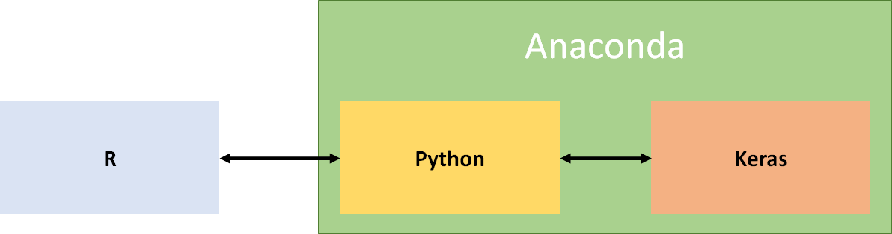
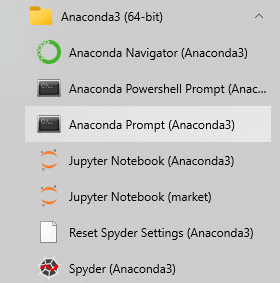
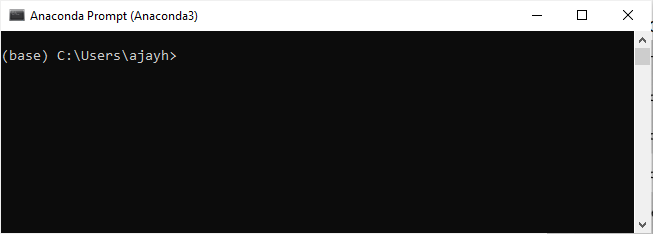
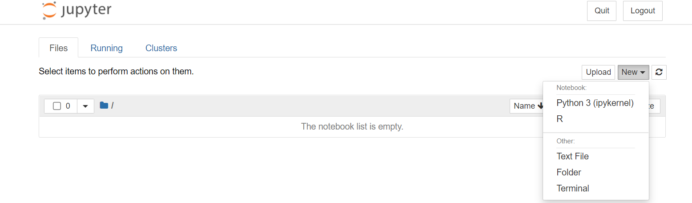

For the workshop we require `R`, `Keras`, and `Anaconda`.
- [R](https://www.r-project.org/) is a leading tool for statistical computing.
- [Keras](https://keras.io/) is a very popular and easy to use tool for building Deep Neural Networks, and is an Open-Source tool.
- However, Keras by default works only with Python, and so we'll be using an R package, [reticulate](https://rstudio.github.io/reticulate/), to communicate with Python to use Keras in R via Python. So Python here acts as a bridge between R and Keras. For Python to work properly with Keras it needs to have necessary packages installed which will be done through [Anaconda](https://www.anaconda.com/). The [R wrapper for Keras](https://keras.rstudio.com/) will be used in R.

<div>

</div>

Please follow the sequence of steps below to get a working system. <br>
Also a video of the installation is available [here](https://www.youtube.com/watch?v=XgEGyfSJFYw&list=PLhBHsIWXCvwbLfJcoVoFND3I2Cs00YkpA&index=6&t=181s).

**Note:** These instructions are written with a Windows machine in mind. Installations on Mac and Linux may vary slightly.

### [Download](https://www.anaconda.com/products/individual) and install Anaconda

Follow the defaults of the "Individual Edition" installation. There is no need to register on the website (in case popups appear).

<div>

</div>

### Open the Anaconda Terminal

Post anaconda installation, open the Anaconda Terminal (Anaconda Prompt). On windows machines this will be via the start menu. On Mac or Linux it is similar.

<div>

</div>

### Create an Anaconda Environment 

An anaconda environment is a space where all tools required for a project are installed. So when you are required to use another system for this project, or share the tools and its dependencies with colleagues, then you can simply export the project environment and share it with them.

A blank anaconda terminal will look like this:  

<div>

</div>

Here `(base)` refers to the default anaconda enviornment present in anaconda. The current anaconda terminal name is given in round braces.

You can create the anaconda environment "ML-Workshop" using the following command:

`conda create --name ML-Workshop`

### Switching to an environment

There can be multiple environments, each corresponding to a project. You can select a particular environment, say `ML-Workshop` using the following command:

`conda activate ML-Workshop`

Now you'll see `(ML-Workshop)` instead of `(base)`.

### Ensuring Python is installed

Install Python (in the current enviornment):

`conda install -c anaconda python=3.7`

### Installing Tensorflow using Anaconda

We need the `tensorflow` package to be installed via Anaconda, before `keras` because keras sits on top of tensorflow

`conda install -c anaconda tensorflow`


### If you don't have R installed, install it

You may probably have R installed in your system. In case you don't then download and [install R](https://www.r-project.org/)

### Add R to the Windows Path
Once you add R to the Path, you can open up a terminal and type `R`, and it should enter the R interactive terminal.
Follow these steps to add R to the Path on Windows:
1. Search the Windows Start Menu for 'Environment variables' and click the 'Edit environment variables for your account'.
2. Click the 'Environment Variables' button at the bottom right of the window that appears.
3. Select the 'Path' row in the top section of the window that appears and click 'Edit'.
4. Click 'Browse' and browse to the location of your R executable file (usually C:\Program Files\R\<R version>\bin\x64).
5. Click 'Ok' on all the windows to close them.
6. Restart your console.

### Open R interactive terminal inside `ML-Workshop` environment
- open anaconda prompt
- type `conda activate ML-Workshop`
- type `r` and then hit `Enter`

### Integrating Keras with R

`reticulate` package is used by R to communicate with a Python instance installed in an anaconda environment. On Linux, you may need to first run `sudo apt install libpng-dev` or `sudo yum install libpng-devel` at a shell prompt to install its dependencies. Install and load the same as below:


```R
install.packages("reticulate")
library("reticulate")
```

specify the name of anaconda environment to check


```R
use_condaenv("ML-Workshop")
```

select the particular python instance for R to communicate with.


```R
use_python(Sys.getenv("CONDA_PREFIX"))
```

Ensure that the Rcpp package is up-to-date:


```R
install.packages("Rcpp")
```

Install keras packages in R and its accompanying python package, from R (note it is safe to ignore the "error" about pip and h5py).


```R
install.packages("keras")
library('keras')
install_keras()
```

With this the intergration should be complete, and you can check the same by executing the below line of code.


```R
mnist <- dataset_mnist()
```

We also need to install some R packages as used by the other notebooks


```R
install.packages(c("plot.matrix","plotly","h2o","MASS"))
```

### Installing Jupyter Notebook

Jupyter provides an interactive enviornment for notebooks. Install it via: 

`conda install -c anaconda jupyter`

If you have never used Jupyter before, you can view this [video](https://www.youtube.com/watch?v=DKiI6NfSIe8) to get a feel for it.


### Jupyter Notebook Kernel

Jupyter connects to multiple language kernals including Python, R, and Julia. By default Jupyter would contain only a Python kernel after installation. The `R` option as shown below wouldn't be present. So only Python code can be executed. Since we'll test our code using R in Jupyter we need to setup an R kernel.

<div>

</div>

### Connect R to Jupyter
 
In R, install the package `IRkernel` via, `install.packages('IRkernel')`.

Then execute `IRkernel::installspec(user = TRUE)`

This will connect the Jupyter system to R.

Now when you run Jupyter via,

`jupyter notebook` (in the Anaconda prompt), you will able to create an R Notebook.


At this point open this notebook via Jupyter (you might have been looking at it before via NBViewer or similar). You can now run R commands in it. e.g:


```R
1+1
```
